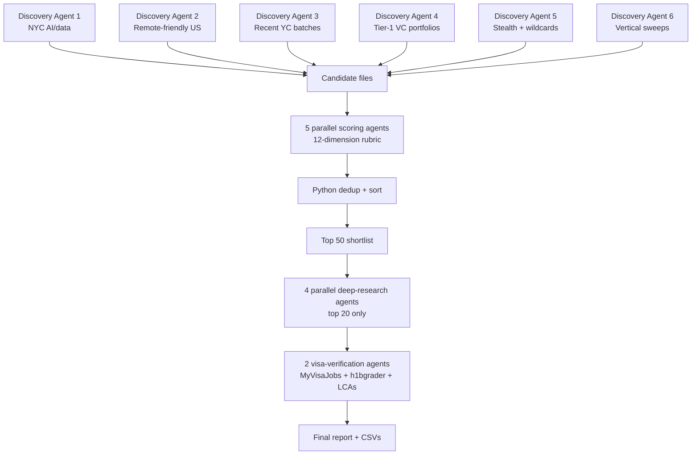

## What it does

A reusable agent pipeline that surveys the AI/data startup universe (~600–1,000 companies at seed–Series B), applies a thesis-driven scoring framework, and produces a ranked shortlist with deep-dive analyses and visa-verification evidence — in 2–3 hours of parallel agent work instead of weeks of manual research.

## Who it's for

Senior operators running their own thesis-driven pipelines who need to:

- Evaluate hundreds of companies at depth, not just respond to recruiter inbound or VC noise
- Apply consistent scoring (problem quality, founder-market fit, AI/data leverage, defensibility) across a wide surface
- Pull visa-sponsorship evidence from primary sources (MyVisaJobs, h1bgrader, USCIS) — not infer from cap tables
- Refresh the universe monthly with a delta report rather than rerun the whole thing

## Architecture

## Key design choices

- **Parallel agents over monolithic prompts.** Each discovery agent owns one vertical or source, so eight ran in parallel instead of one slow sequential pass. Output landed in disk-persisted files — context compaction couldn't lose hours of work.
- **Disk persistence between phases.** Every agent wrote a Markdown or CSV file rather than returning content in chat. In a 2+ hour pipeline, this is non-negotiable.
- **Inline-return fallback for Write permission denials.** When five of eight agents hit Write permission errors on the first run, they returned content inline as their final message. The parent agent persisted it. The pipeline survived the failure mode.
- **Cross-batch dedup in Python, not in agents.** LLMs hallucinate "same company" matches. I deduped by normalized company name in a Python script — cheap, exact, debuggable.
- **Visa verification as a separate phase, not embedded.** The first scoring pass *inferred* visa feasibility from cap table size, headcount, and HQ. The verification pass pulled live LCA records. The two passes disagreed on four of ten top picks — and the verified data produced material downgrades for several "obvious" candidates.

## Key result

- **Universe surveyed:** 653 unique AI/data startups at seed–Series B across 14 verticals
- **Time investment:** ~3 hours of agent runtime + ~2 hours of analyst review
- **Output:** top-20 deep-dive case studies, top-10 with verified visa evidence, monthly-refresh template
- **Surprising signal:** the strongest predictor of long-term visa pathway is *PERM completion rate*, not LCA volume. Several well-funded sponsors had 10+ LCAs but zero completed PERMs — meaning their sponsored hires consistently left before the green card finished. This shifted the recommended action plan for the top three candidates.

## What I'd build differently next time

- **Run discovery and scoring in the same agent pass.** Separating them across two phases doubled the LLM cost and added coordination overhead with no real quality gain.
- **Version-control the scoring rubric separately from agent prompts.** I mixed them; when I changed the rubric mid-run, I had to re-dispatch agents instead of just re-scoring existing rows.
- **Pre-build a legal-entity-name mapping.** Several visa lookups failed because the legal entity (e.g., "Cascading AI Inc" for Casca, "Eminent INC dba Revolve Clothing" for Revolve) differs from the brand. A pre-mapping step would have saved an hour and avoided two false-negative misses.

## Tech stack

Claude Code · Python 3.9 (pandas, csv) · Markdown for human-readable outputs · MyVisaJobs / h1bgrader / h1bdata for visa evidence · GitHub Actions for monthly refresh

## Code

Pipeline code is private due to commercial sensitivity around the screened companies and personal visa data. Happy to walk through the architecture and methodology in conversation.
